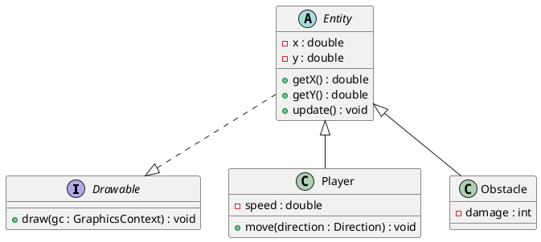

# Conception technique

> Ce document décrit l'architecture technique de votre projet. Vous êtes dans le rôle du lead-dev / architecte. C'est un document technique destiné à des développeurs.

## Vue d'ensemble

<!-- Décrivez les grandes briques de votre application et comment elles communiquent. Un schéma d'architecture est bienvenu. -->

## Design Patterns

### DP 1 — Factory Method

**Feature associée** : Fonctionnalité 1 — Suivi de progression intelligent.

**Justification** : Centralise la création des différents supports (Vidéo, Quiz, PDF). Cela permet au système de suivi de manipuler une interface commune sans connaître les détails techniques de chaque média.

**Intégration** : Une `ContentFactory` instancie le bon module pédagogique selon les données de la base.

### DP 2 — Strategy & Factory

**Feature associée** : Fonctionnalité 2 — Paiement sécurisé et instantané.

**Justification** : Le **Strategy** rend l algorithme de paiement interchangeable (Stripe, PayPal). On y ajoute une **Factory** pour instancier la bonne stratégie selon le choix du client, isolant totalement la logique financière.

**Intégration** : Le `PaymentProcessor` demande une stratégie à la `PaymentFactory` et exécute le paiement de manière générique.

### DP 3 — Observer

**Feature associée** : Fonctionnalité 3 — Système d alertes automatiques.

**Justification** : Évite un couplage fort entre les cours et les notifications. Le cours se contente d émettre un signal de mise à jour, et les abonnés réagissent selon leurs préférences (Email, Push).

**Intégration** : La classe `Formation` (Sujet) notifie ses `Observers` (Étudiants) dès qu un nouveau contenu est validé.

### DP 4 — Decorator

**Feature associée** : Fonctionnalité 4 — Offres et options personnalisées.

**Justification** : Permet d ajouter des couches de prix ou de services (Promotions, Certificats) à une formation de base sans multiplier les sous-classes inutiles. C est la solution la plus flexible pour le calcul de prix dynamique.

**Intégration** : Un `PromotionDecorator` enveloppe l objet `Formation` pour appliquer une réduction sur la méthode `getPrice()`.

### DP 5 — Builder

**Feature associée** : Fonctionnalité 5 — Organisateur de cours structuré.

**Justification** : La création d un syllabus est complexe et sujette aux erreurs de saisie. Le Builder permet de construire le plan de cours étape par étape et de valider la cohérence (ex: présence d un titre) avant de créer l objet final.

**Intégration** : La classe interne `SyllabusBuilder` rassemble les éléments du cours et verrouille l objet une fois construit pour garantir l intégrité des données.


## Diagrammes UML

### Diagramme 1 — *Type (classe, séquence, cas d'utilisation…)*

<!-- Exemple de syntaxe PlantUML (à remplacer par votre diagramme) :



Ceci est un exemple, remplacez-le par votre propre diagramme. -->

```plantuml
@startuml

@enduml
```

### Diagramme 2 — *Type*

```plantuml
@startuml

@enduml
```

