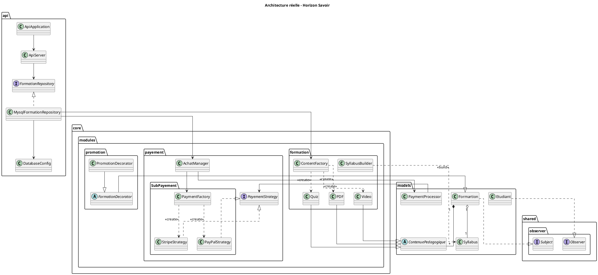

# Document de réversibilité technique

> Ce document est destiné à l'équipe qui reprendra la maintenance du projet. Soyez honnêtes et exhaustifs. Pas d'enjolivement.

## Architecture actuelle

Le projet suit une architecture en 4 couches : **API** (serveur HTTP + routes) → **Core** (logique métier, Design Patterns) → **Models** (entités de données) → **Shared** (interfaces transversales). La persistance est assurée par MySQL via JDBC.

L'application expose deux points d'entrée :
- `App.java` : démonstration console des fonctionnalités métier.
- `ApiApplication.java` : serveur HTTP qui sert l'API REST et le frontend web.

**Flux d'exécution de l'API :**
1. `ApiApplication.main()` résout le port (arg → env `API_PORT` → 8080 par défaut), instancie `ApiServer` et démarre le serveur HTTP.
2. `ApiServer` enregistre deux contextes : `/` pour le frontend statique, et `/api` pour les routes REST.
3. `MysqlFormationRepository` ouvre une connexion JDBC par requête (pas de pool de connexions).

## Bugs connus

| Bug | Sévérité | Conditions de reproduction |
|-----|----------|---------------------------|
| La création d'une formation via l'interface web retourne une erreur (`Cannot read properties of null (reading 'reset')`) mais la formation est quand même créée en base. En cliquant plusieurs fois, on se retrouve avec des doublons. | Majeure | Créer une formation depuis le formulaire web — l'erreur s'affiche mais la formation apparaît après rafraîchissement |
| Aucune contrainte d'unicité sur les formations : on peut créer plusieurs formations identiques (même titre, même prix). | Majeure | Soumettre le formulaire de création plusieurs fois avec les mêmes données |
| `PayPalStrategy.pay()` simule un paiement sans vraie intégration. Le paiement retourne toujours `true`. | Majeure | Tout achat via PayPal réussit systématiquement |
| Pas de pool de connexions : chaque requête API ouvre une nouvelle connexion MySQL. | Majeure | Envoyer de nombreuses requêtes API simultanées |

## Limitations techniques

- **UX à revoir** : l'interface web est fonctionnelle mais l'expérience utilisateur manque de finition. La navigation entre les pages, les retours visuels après une action (succès/erreur) et l'ergonomie générale des formulaires nécessitent un travail de design et d'intégration.
- **Pas d'authentification** : l'API est ouverte, n'importe qui peut créer des formations, inscrire des étudiants ou lancer des paiements.
- **Pas de validation des entrées** : les requêtes POST ne vérifient pas la cohérence des données (prix négatif, type de contenu invalide). Seule la validation d'email dans `Etudiant` est implémentée.
- **L'Observer n'est pas persisté** : les notifications sont émises en mémoire (console). Les abonnements sont perdus à chaque redémarrage de l'API.
- **Le `SyllabusBuilder` ne valide rien** : le Builder ne vérifie pas la cohérence du syllabus avant `build()`, il retourne simplement l'objet tel quel.

## Points de vigilance pour la reprise

- **Typo `Formartion`** : le nom de la classe est `Formartion` partout (modèle, repository, API). Un renommage global via le refactoring de l'IDE est nécessaire.
- **Typo `PayementStrategy`** et package `SubPayement` : mêmes fautes de frappe à corriger.
- **`PaymentProcessor` mal placé** : cette classe est dans `models/` mais contient de la logique métier. Elle devrait être dans `core.modules.payement`.
- **MySQL requis** : l'API ne démarre pas sans MySQL. Lancer `docker compose up` est un prérequis avant de lancer l'API.
- **`Draft.java` à supprimer** : fichier de brouillon laissé dans le code source.

## Améliorations recommandées

| Amélioration | Difficulté | Justification |
|--------------|------------|---------------|
| Retravailler l'UX du frontend (navigation, feedbacks visuels, ergonomie) | Moyen | L'interface est fonctionnelle mais pas assez intuitive |
| Corriger le bug de création de formation (erreur JS + doublons) | Facile | Bug le plus visible pour l'utilisateur |
| Renommer `Formartion` → `Formation` et `PayementStrategy` → `PaymentStrategy` | Facile | Corrige les fautes de frappe dans tout le projet |
| Ajouter un pool de connexions (HikariCP) | Facile | Évite l'épuisement des connexions MySQL |
| Écrire de vrais tests unitaires | Moyen | Aucun test actif actuellement |
| Implémenter une vraie intégration PayPal | Moyen | `PayPalStrategy` est un stub |
| Ajouter de l'authentification sur l'API | Moyen | L'API est entièrement ouverte |
| Persister les notifications en BDD | Moyen | La table `notifications` existe dans le schéma SQL mais n'est pas alimentée |
